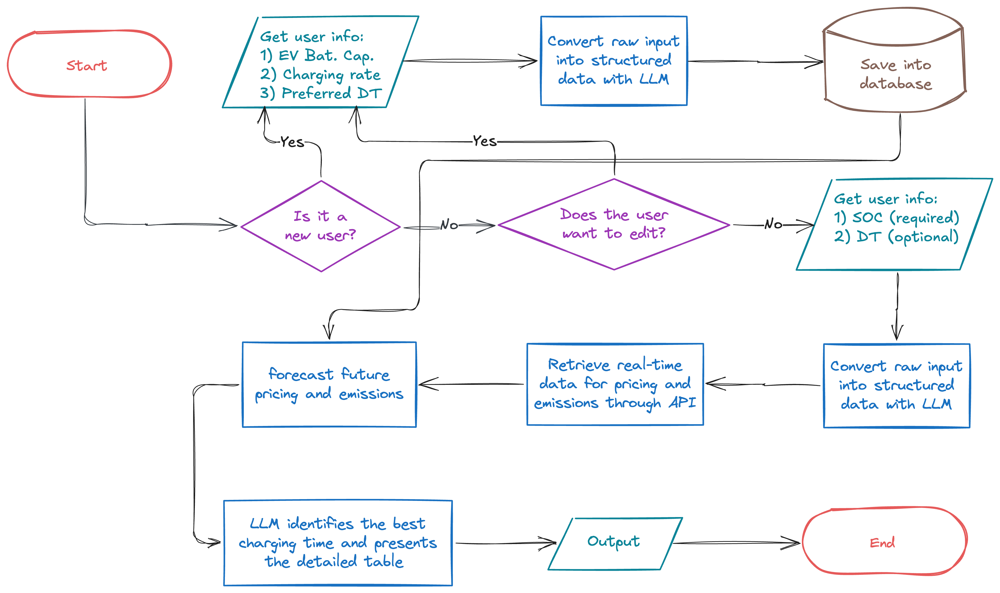
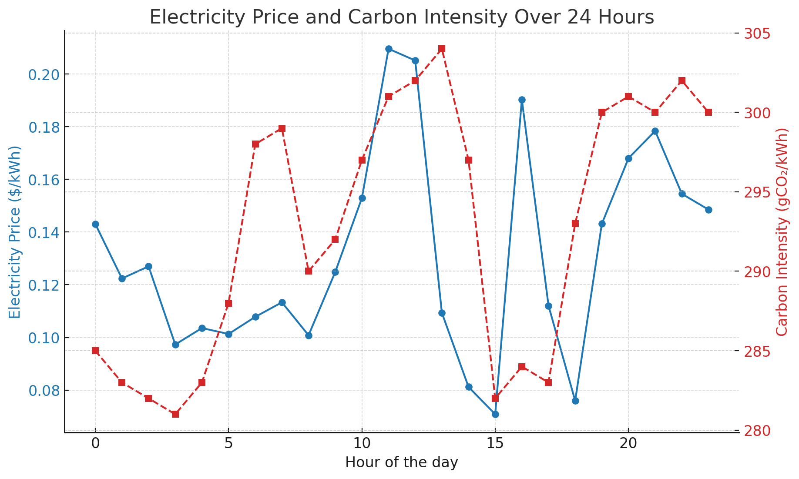

# EV Smart Charging Bot



**EV Smart Charging Bot** is a Telegram bot that helps electric vehicle (EV) owners find the optimal charging schedule for their cars. By analyzing real-time and forecasted electricity prices and emission rates, the bot provides a detailed charging plan that minimizes cost and environmental impact. The bot uses machine learning and a sequence-to-sequence LSTM model for forecasting and integrates the Gemini LLM to handle user inputs in natural language.

---

## Features 🚀

- **Real-time optimization**: Retrieves real-time electricity price and emission data through APIs.
- **Future prediction**: Predicts the next 24 hours of electricity prices and emissions using a trained LSTM model.
- **Custom user inputs**: Allows users to input their EV’s battery state, capacity, charging rate, and departure time.
- **Intelligent recommendations**: Suggests the most cost-effective and eco-friendly charging schedule.
- **Natural language interface**: Utilizes the Gemini LLM to parse user inputs and refine user interaction.
- **Interactive output**: Provides a detailed breakdown of costs and emissions for various charging times.

---

## Project Architecture 🏗️

This project comprises multiple components:
1. **Telegram Bot**: Main interface for users to interact with the system.
2. **Data Processing**: Handles data cleaning and preprocessing for both training and prediction.
3. **Machine Learning Model**: LSTM model for forecasting future prices and emissions.
4. **Real-time Data Retrieval**: API integration to fetch live electricity prices and emissions.
5. **Database**: Stores user information and charging preferences.



---

## Results 📊

Here’s an example interaction:

**User**: `Battery is at 65%`

**Bot**: 
```
Current Status:
• Battery Level: 65.0%
• Departure Time: 8:00 AM
• Battery Capacity: 75.0 kWh
• Charging Rate: 7.0 kW

Analyzing optimal charging times...

It will take 3 hours and 45 minutes to charge your EV.

Here are your potential savings if you start charging at different times:

Start Time  Cost Savings  CO2 Savings
------------------------------------
10:03 PM    $  0.00       0.0 g
11:03 PM    $  3.52     -40.5 g
12:03 AM    $  8.65     -78.3 g
01:03 AM    $  4.67    -122.5 g
02:03 AM    $  2.70    -136.6 g
03:03 AM    $ -1.40    -140.2 g
04:03 AM    $ -3.60    -150.7 g
```

---

## Installation & Setup ⚙️

1. Clone this repository:
   ```bash
   git clone https://github.com/srmadani/ev-charging-tg-bot.git
   cd ev-charging-tg-bot
   ```

2. Install dependencies:
   ```bash
   pip install -r requirements.txt
   ```

3. Set up your environment variables:
   - `TELEGRAM_BOT_TOKEN`: Your Telegram bot token.
   - `GOOGLE_API_KEY`: Your gemini token.
   - `emission_api_token`: Keys for accessing real-time emissions APIs.

4. Start the bot:
   ```bash
   python main.py
   ```

---

## File Structure 📁

### Root Directory
- **`main.py`**: Main entry point for running the Telegram bot.
- **`llm.py`**: Handles user inputs and converts them into structured data using the Gemini LLM.
- **`pred.py`**: Contains the LSTM model and prediction logic for price and emissions.
- **`reg.py`**: Manages user registration and updates user preferences.
- **`retrieve_data.py`**: Fetches real-time electricity prices and emissions data via APIs.
- **`bot_database.db`**: SQLite database storing user information and preferences.

### `data_processing/` Directory
- **`data_collection.py`**: Scripts for collecting and preprocessing raw data for training.
- **`dtraining.py`**: Scripts for training the forecasting model and getting forecasts for the next 24 hours.
- **`trained_model.h5`**: Pre-trained LSTM model for predicting future prices and emissions.

---

## Datasets 📂

1. **Emission Rates**: [Electricity Maps](https://www.electricitymaps.com/)
2. **Electricity Prices**: [NYISO Custom Reports](https://www.nyiso.com/custom-reports)

Both datasets are used for training the model and fetching real-time data through APIs.

---

## Reproducibility 🔁

To reproduce the results:
1. Train the LSTM model:
   ```bash
   python training.py
   ```
2. Use the `main.py` to test the bot's interaction and predictions in real-time.

---

## License 📜

This project is licensed under the MIT License.

---

## Acknowledgments 🙌

Special thanks to:
- **Electricity Maps** and **NYISO** for the datasets.
- The developers of the Gemini LLM for its robust natural language capabilities.

---

## Contact 📬

Feel free to open an issue or reach out for any questions!
